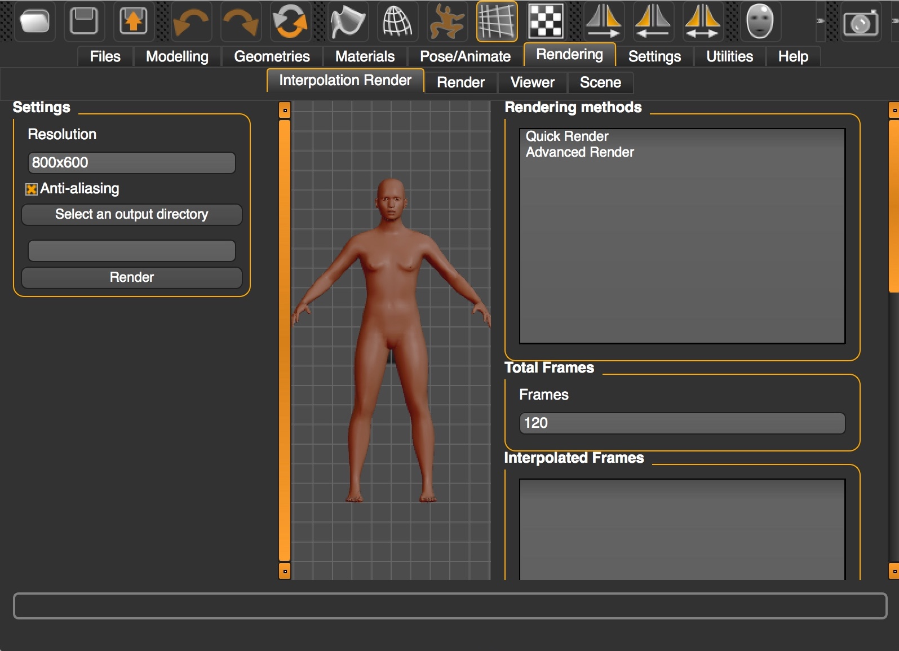

# FaReT
**Fa**ce **Re**search **T**oolkit: A free and open-source toolkit of three-dimensional models and software to study face perception.


Please use the following reference when you use FaReT in your research:

**Hays, J. S., Wong, C., & Soto, F. (2020). [FaReT: A free and open-source toolkit of three-dimensional models and software to study face perception](https://psyarxiv.com/jb53v/). *Behavior Research Methods, 5.*(6), 2604-2622.**

If you find FaReT useful for your research, please consider supporting the developers who maintain and develop [MakeHuman](http://www.makehumancommunity.org), the free and open source 3D computer graphics software that FaReT uses to create face stimuli. You can do that in their [Patreon page](https://www.patreon.com/makehuman)

## Table of contents
* [Installation](#installation)
* ["Morphing" in 3d shape space](#morphing-in-3d-shape-space)
   * [Interpolation (i.e., morphing)](#interpolation-ie-morphing) 
   * [Extrapolation (i.e., caricaturing)](#extrapolation-ie-caricaturing)
* [Creating average models](#creating-average-models)
* [Standardizing models](#standardizing-models)
* [Creating dynamic animations from render sequences](#creating-dynamic-animations-from-render-sequences)
* [Communicating with Psychopy to render faces online](#communicating-with-psychopy-to-render-faces-online)

# Installation
## Install pre-requisites
* You can download and install MakeHuman (stable version) from the following website: <http://www.makehumancommunity.org/content/downloads.html>. This is all you need to use FaReT and generate single face images.
* We have also developed a GIMP plugin that generates dynamic GIF files from a sequence of images rendered from MakeHuman. To use this plugin, download and install GIMP from the following website: <https://www.gimp.org/>

## Download FaReT
* Click on the green button labeled `Clone or Download` above, and then choose `Download ZIP`
* Once the ZIP file is downloaded, open it with your unzipping software.

## MakeHuman plugins
* Locate your makehuman installation directory.
    * **On Windows**, find the MakeHuman shortcut located where you unzipped MakeHuman. Right-click on the shortcut and choose `Open File Location`. This will open the installation folder.
    * **On MacOS X**, open Finder and go to the folder where MakeHuman has been installed. This is usually the `Applications` folder. Right-click (or control+click) the MakeHuman shortcut and choose `Show Package Contents`.
    * **On Debian-like** systems, when using a package management, the folder is found at `/usr/share/makehuman`. 
* Inside the MakeHuman directory, go to the sub-folder `Resources/plugins` (MacOS X; **not** the `PlugIns` folder inside `Contents`, but a subfolder inside the `Resources` folder) or `plugins` (others).
* From the downloaded FaReT folder, copy the entire sub-folders `4_average_model`, `4_interpolate_render`, `4_socket_psychopy`, and `4_standardizer`.
* Paste the subfolders and their contents into MakeHuman's plugins folder.
* If you already had MakeHuman open ***before*** you installed the plugin, close it and ***re-open*** it so that the plugin will load.
* When loaded correctly, each plugin will produce a new menu as described below.

## GIMP Plugin
* If GIMP is already opened, close it.
* From the downloaded FaReT folder, copy the `make_gif_plugin.py` file and paste it into the **.gimp-2.8/plug-ins** folder.
    * Refer to this page <https://en.wikibooks.org/wiki/GIMP/Installing_Plugins> for specific plugin installation instructions depending on your operating system. 

# "Morphing" in 3d shape space
## Interpolation (i.e., "morphing")
* Go to the `Rendering` tab and then to the `Interpolation Render` sub-tab.
* Because it is an altered version of the Render Task View, it has the same options and more (which were mostly added in the right panel).
* 

* On the left, specify the folder in which you want the program to output the PNG files for each frame of the morph.
  * The images that go into that directory have a naming convention such that the first frame is MH_0000.png, the second is MH_0001.png, etc.
  
### **Total Frames**
* The integer value represents the number of pictures that will be outputted to the output directory.
* Having higher values leads to more precision in the morphs, but also larger GIF file sizes and longer rendering times.
* To test your interpolation settings quickly, start with a small number of total frames. 

### **Interpolation Frames**
* Each row represents a key frame: a starting/ending point of a transformation.
* The **Add Frame** button will save the contents of the Interpolation Settings (below) to a new key frame in the Interpolation Frames list.
* The **Remove Frame** button will delete the selected key frame from the list.
* The **Save As** button will allow you to store your settings into a JavaScript Object Notation (JSON) file so that you do not have to redo them repeatedly.
* The **Load** button loads your previously saved settings from any given json file.

### **Interpolation Settings**
* Once you add a frame, select it to edit the interpolation settings. 
* The **Current Frame** represents the time at which the settings listed below should be reached.
  * By specifying an integer, you can set a specific frame (like frame 61). Integer values should start with 0 and end with the number of total frames minus one.
  * By specifying a float between 0.0 and 1.0, you can specify the proportion of the total frames (i.e., 0.5 is halfway through the animation).
  * ***Important***: there should always be one key frame that is at frame 0 (start of the morph) and one key frame that is at at 1.0 (end of the morph).
    * 
    * Unless there is only one frame, in which case, you can have just key frame 0.
* For ***any of the following settings***, you do not need to specify them after the first frame (unless you want them to change).
    * The **Orbit Camera Y** setting can be set to an angle (in degrees).
      * The value causes left-right motion to occur (positive values rotate to the head's right -- your left).
      * These are values *in an absolute coordinate system* rather than relative to the previous frame.
    * The **Orbit Camera X** setting can also be set to an angle (in degrees).
      * The value causes up-down motion to occur (positive values rotate to the top of the head).
      * These are values *in an absolute coordinate system* rather than relative to the previous frame. 
    * The **Model File** input box takes the path of a mhm file that you want to have by the current key frame.
    * The **Expression File** input box can either:
      * take an expression mhpose file or..
      * take the word **None**, which means that it should use a neutral expression.
        * The word none is necessary, if no expression will be used. 
* The Update Frame button will change the parameters of a ***selected*** frame.
  * Do *not* select a new frame after making changes you want to save because that will load that frame, overriding your changes.  
  * If you forgot to select the frame first (or the GUI code deselected it after a previous Update), then you can use the **Add Frame** button instead and then remove the frame you wanted to replace/update.

## Extrapolation (i.e., "caricaturing")
* This is just another option in the `Interpolation Render` plugin, so read the previous documentation about interpolation before proceeding.
* To extrapolate, you will first need to define a sequence of at least two models using the **Interpolation Render** GUI (see above).
* The only extra step is to define a percentage of extrapolation for the identity model under **Model Extrapolation Percentage** and/or a percentage of extrapolation for the expression pose model under **Expression Extrapolation Percentage**.


# Creating average models
* The **Average Model** menu is under the **Utilities** menu.
* The **Input Directory** specifies the location of the \*.mhm model files you want to average.
  * Keep in mind: the input directory only grabs \*.mhm files from that directory and one layer of subdirectories.
    * i.e., when selecting **identity_models**, it can reach **identity_models/male/\*.mhm**,
    * but not:  **identity_models/male/happy/\*.mhm**
* The **Start** button will generate the average model from the files in the input directory (this may take some time).
  * **Important**: When it finishes, be sure to use MakeHuman's normal save feature to save the average mhm file!
    * Go to the **Files** tab, and then to the **Save** sub-tab.
    * Choose a directory and a name for your average file, and click on "Save".
* The remaining functions are only important if you want to generate faces within the average space (which don't always look great).
    * You can avoid re-creating the average if you **Save the Average JSON** files to the input folder you selected earlier.
      * This creates four json files that keep track of the values for the mean, standard deviation, minimums, and maximums for each parameter.
      * You can Load the Average JSONs from the same folder to reload the average model and the parameters for the average space.
    * **Generate Randomly from Average** uses the average parameters, the standard deviations, and the upper and lower limits to generate a new face.
        * Values are sampled from a normal distribution using the mean and standard deviation, but they cannot exceed the minimum or maximum values.
        * If there is only one possible value, it is selected.

# Standardizing models
* The **Standardize Models** menu is under the **Utilities** menu.
* Click on **Select an output directory** and choose a folder where you want the standardized model(s) to be stored.
* Click on **Select an input directory** and choose a folder where you have placed the original unstandardized model(s). These should be MakeHuman models with extension `.mhm`, like the models in the database included with FaReT.
* Click on **Select the standard model** to choose a single MakeHuman model (i.e., with extension `.mhm`) from which features will be copied for the standardization.
* In the box labeled **Features to standardize**, you can add specific features that you want to standardize, or regular expressions that apply to several features.
  - Each feature name or regular expression should be separated by a comma and space.
  - To see a list with the names of all the features that you can choose from, open any of the `.mhm` files included in the FaReT database. The name of each feature is included after the keyword `modifier`.
  - To learn about Perl regular expressions, see the documentation [here](https://perldoc.perl.org/perlre.html)
* Once you are ready, click **Go** and you will obtain standardized models in the output directory.

# Creating dynamic animations from render sequences
## Using GIMP plugin to create GIF files
### **GUI**
If you only need to produce one GIF file, this is the easiest way to do it.
* The **Make-GIF** button will appear at the bottom of the Filters Menu (underneath the Python-Fu and Script-Fu buttons).
* In the **first text-box**, provide the path to the folder containing the PNG image frames that you produced with MakeHuman.
* In the **second text-box**, provide the output path and the output file format -- the GUI can only produce one GIF at a time, so any filename ending with ".gif" is fine.
* The **Frames per second box** is the delay between switching frames in milliseconds.  The default is for 30 frames per second (33.3333 ms).

### **Python-Fu**
If you want to produce several GIF files, then this is the best way to do so.
* Use the Python-Fu console in GIMP (modify the input paths under the **# call the function** comment):
```python
def mass_make_gifs(super_path, out_file_path_format, fps=33.33333):
    # super_path contains multiple folders that each have PNG files
    # out_file_path_format has the _existing_ output directory 
    #  AND the file format:
    # out_file_path_format = "C:/Users/Jason/out_directory/MH_{0:04d}.gif"
    paths = [os.path.join(super_path, folder) for folder in os.listdir(super_path)]
    pdb.python_fu_make_gif(paths, out_file_path_format, fps)
    
# call the function
mass_make_gifs("C:/path-to-png-folders/", "C:/path-to-png-folders/MH_{0:04d}.gif", 33.33333)
```

## Using ImageJ to create AVI files
* Sometimes you might want to create AVI files rather than GIFs, because it is easier to display AVIs in some experimental software (e.g., Psychopy) and/or because creating AVIs allows more control over the number of frames per second in the resulting animation.
* Download ImageJ from [this website](https://imagej.net/Downloads) and run it.
* Drag the folder containing the sequence of images previously created with FaReT and drop it on the ImageJ windows.
* A prompt will appear asking if you want to open all the images in the folder as a stack. Click on "Yes".
* Go to **File > Save as > AVI**
* Choose your preferred compression and animation speed (frames per second) and proceed.
* Name your file and save.

# Communicating with PsychoPy to render faces online
The Socket Render plugin is made for telling MakeHuman what to do from PsychoPy or any Python project.

## PsychoPy Installation
Copy these files next to your PsychoPy experiment file (or into the site-packages library that PsychoPy uses):
* communicator.py
  * MakeHuman also needs communicator.py, so do not use Cut to move it out of 4_socket_render: Copy it.
* py_client.py

## Setting up MakeHuman
* In MakeHuman, navigate to the Rendering tab at the top of the window.
* Select the "Socket Render" subtab.
* When you are ready to open a connection to PsychoPy, push the button labeled "Socket Render", which starts a local server that is waiting for the py_client to connect.  
  * MakeHuman will appear to "stall" while it is waiting for input from the Python client: you cannot interact directly with MakeHuman's GUI while it is taking instructions from the Python client.
* Make sure that you start the server before running the PsychoPy experiment.

## Setting up PsychoPy
Within PsychoPy, you need to import the PythonMHC communication class.
```python
from py_client import PythonMHC
makehuman = PythonMHC()
```
If you want to avoid having to restart MakeHuman every time you exit a PsychoPy run, add this to the beginning of the experiment script as well:
```python
import atexit
# when the session ends, close the link, but keep the server alive, waiting for the next PsychoPy run.
# at the end of a run, makehuman.close() will send the string, 'exit', 
#  to tell MakeHuman's server to wait for another connection from PsychoPy.
atexit.register(makehuman.close)
```

Now you have a connection with MakeHuman from PsychoPy!
The most important function in py_client.py is execute_MH():
* It takes the name of a function as a string,
* Whether you want MakeHuman to return the output of the function,
* Whether you want PsychoPy to wait for that return message to come back before moving on,
* And, the arguments you want to pass to MakeHuman.

This is an example of how you could load a model.
```python
filename = "C:/Example/Model.mhm" # the absolute path
makehuman.execute_MH("gui3d.app.loadHumanMHM", False, False, filename)
```
However, for your convenience, some functions -- like load_model() -- are set up ahead of time:
```python
# makehuman.*function* functions almost all wrap around execute_MH()
makehuman.load_model(filename)
# make the camera look at the face
makehuman.setFaceCamera()

# zoom out by "10"
makehuman.zoom(10)
# zooming in uses negative numbers.
#makehuman.zoom(-10)

# set the orbit camera to the left.
makehuman.setCamera(0,45)
# retrieve the shape parameter dictionary
params = makehuman.get_model_params()

# alter the params so that they have a large forehead
params['forehead/forehead-scale-vert-decr|incr'] = 1
# set and update the model's shape parameters
makehuman.set_model_params(params)

emotion_file = "C:/Example/Emotion.mhpose"
# load the expression parameters for neutral and some emotion (as specified by an mhpose file).
neutral, emotion = makehuman.load_expression(emotion_file)
# set an emotional expression at a specific percentage
makehuman.set_expression(neutral, emotion, 50.0) # 0.0 would be purely neutral, 100 would be "fully" expressing the emotion.

# you can specify how you want MakeHuman to render each stimulus.
render_settings = dict()
render_settings['AA'] = True#/False #anti-aliasing -- smoothing by rendering at a larger scale and then downscaling
render_settings['dimensions'] = (256, 256) # how big is the image
render_settings['lightmapSSS'] = False # do you want cool, slow to render lighting effects?

save_location = "C:/Example/Image_Folder/"
image_number = 0
# Ask MakeHuman to render and save whatever to the save location, 
#  and wait until MakeHuman finishes before moving on.
image_path = makehuman.get_render(save_location, render_settings, image_number)
# you only need to increment the image number want to reserve
# the previously rendered image for the next time
# (or if you are going to render multiple images in one trial).
#image_number+=1

# $image_path can be given to ImageStim components as long as the Image is set every repeat.
```
```python
# expression parameters are separate from shape parameters.
# if you do not want to load mhpose files, neutral always uses 0's
neutral = dict(RightInnerBrowUp=0)
# however, you don't _have_ to use neutral as a starting point,
#  so you can change what the interpolation percentages
#  mean by altering the starting point.
# other = dict(RightInnerBrowUp=.5)
brow_expression = dict(RightInnerBrowUp=1)
# the arguments are: starting point, ending point, percentage.
makehuman.set_expression(neutral, brow_expression, 75)
# if you just want to set an expression without interpolating, 
# you can use the same one twice at 100 percent.
# makehuman.set_expression(brow_expression, brow_expression, 100)
```
About camera controls:
```python
# rotate camera is relative to the current position,
# but set camera takes the current position into account to negate it.
# doing:
makehuman.setCamera(0,0)
makehuman.rotateCamera(0,45)
makehuman.rotateCamera(0,45)
# is the same as:
makehuman.setCamera(0,90)
```
More about shape parameters:
```python
# shape parameter dictionaries do not need to be loaded from .mhm files.
params = dict()
params['forehead/forehead-temple-decr|incr'] = 1
# this doesn't override other unspecified shape parameters.
makehuman.set_model_params(params)
```

Expression parameters:
```python
# expression parameter dictionaries do not need to be loaded from .mhpose files either.
params = dict()
brow_expression['LeftInnerBrowUp'] = 1
# unlike shape parameters, this does override other unspecified expression parameters.
makehuman.set_expression(brow_expression,brow_expression,100)
```
**IMPORTANT:** 
1. MakeHuman does not recognize numbers created using Numpy that are type `np.int64`, `np.float64`, etc. If you have created values for parameters using Numpy functions, make sure to use `float(your_numpy_number)` as input to the MakeHuman dictionaries.
2. Use absolute paths for your model files and for the folder where your rendered stimuli will be saved. Relative paths sometimes produce errors.


If you want to kill the server without terminating MakeHuman's process, you can send the string 'shutdown' to resume MakeHuman's normal GUI-based operations.
```python
# unlike when MakeHuman receives the 'exit' string (which only indicates that 
#  the PsychoPy/Python client has left),
# shutting down the MakeHuman server means you will have to click the "Socket Render"
# button again before you want to start the next PsychoPy Run.
makehuman.send('shutdown')
```
## Generating a random face model in each trial and rendering it online

The code below uses code from the random face generator plugin to create a random face model, then opens a connection with MakeHuman to render the created model. It can be used to generate and display a different random face in each trial of an experiment, with control over what features are fixed vs. random. You would usually want to do this ahead of the experiment using the random face generator plugin within MakeHuman. The example below would be useful if there are too many random faces to render (e.g., trial-unique stimuli with manipulation of other factors, such as expression).

```python
# the face_generator.py file is from the face generator plugin
import face_generator as fg
import numpy as np
import os
from glob import glob
# the socket plugin comes with py_client.py
from py_client import PythonMHC

# first, setup your directories and load your pre-existing sample models:
# the psychopy project directory
path = "C:\\Users\\jason\\Documents\\_Research\\makehuman\\socket_tester"
# where are you saving your mhm files?
out_model_path = os.path.join(path,"generated_models")

# where are the pre-established models (aside from the average identity)?
model_samples = os.path.join(path,"sample_models")
models_list = glob(os.path.join(model_samples, "*.mhm"))

# where are you saving your images?
img_path = os.path.join(path,"renders")

# set the path/name to your average identity
avg_path = os.path.join(path,"identity_average.mhm")
# load the average identity's parameters
avg = fg.read_params(avg_path)

# load the other models' parameters
full_params = [fg.read_params(f) for f in models_list]

# load the keys, the average, and the rest of the models
all_stuff = fg.get_ordered_values(avg, *full_params)
# the keys for the features being changed
keys = all_stuff[0]
# the average face parameters (similar to avg, but it includes 0's for key values that exist in the other model files)
avg_face = all_stuff[1]
face_arr = np.array(all_stuff[2:])
radius, face_arr = fg.set_faces_to_radius(avg_face, face_arr)


# get ready to actually make models and render things.
# what model_number are you on now?
model_number = 0
# these are the render settings
# you may want a different image size
size = (300,300)
settings = dict(AA=True, dimensions=size, lightmapSSS=True)

# start the socket client (do this after you already pressed the Socket Render button in MakeHuman)
makehuman = PythonMHC()

# make and render 1 face per trial or stimulus
# (could use this "try-except" in a code component before a presentation trial routine 
#  or you could put it into a loop to make stimulus models and images ahead of time)
try:
    # make a model (depending on your experiment, you could make a bunch ahead of time, 
    #  but then you may as well use the Generate Faces plugin on the GUI instead)
    faceX = fg.make_new_face(avg_face, face_arr)
    
    # save a model to model_path
    model_path = os.path.join(out_model_path, "face{0:04d}.mhm".format(model_number))
    fg.write_mimic_file(avg_path, model_path, keys, faceX)
    
    # load the model into makehuman
    makehuman.load_model(model_path)
    # render the model
    # use the "image_path" variable in a PsychoPy ImageStim image instead of printing it
    image_path = makehuman.get_render(img_path, settings, model_number)
    #print(image_path)
    
    # get ready for the next model
    model_number+=1
    
except Exception as e:
    print(e)
    makehuman.send("shutdown")
#finally:
# at the end of the experiment (or the end of your code), you can shutdown and close the socket so that makehuman will 
#  function normally until you hit the Socket Render button again.
makehuman.send("shutdown")
```


